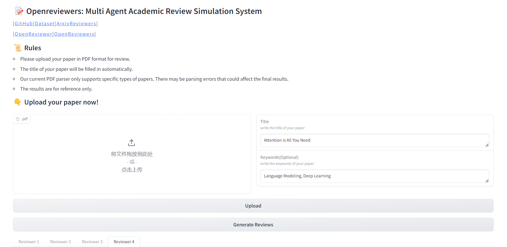
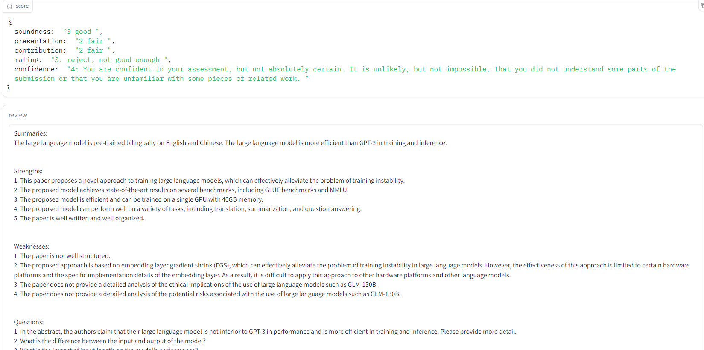
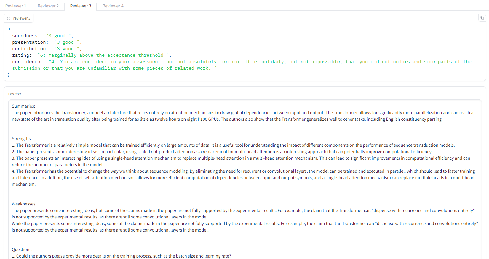
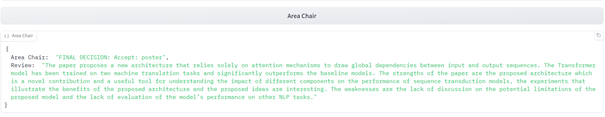

# OpenReviewers
### Multi Agent Academic Review Simulation System

<p align="center">
   🤗 <a href="https://cloud.tsinghua.edu.cn/d/7391d8c3132c4e8085d9/" target="_blank">Model</a> • 📚 <a href="https://cloud.tsinghua.edu.cn/d/7391d8c3132c4e8085d9/" target="_blank">Data</a> • 📜 <a href="http://116.204.104.227:5173/" target="_blank">ArxivReviewers</a> • 👨🏻‍🚀 <a href="http://116.204.104.227:10729/" target="_blank">OpenReviewer</a> • 🖥️ <a href="http://116.204.104.227:10730/" target="_blank">OpenReviewers</a>
</p>

<div align="center">

</div>

OpenReviewers项目构建了一个基于多智能体的学术论文评审模拟系统。该系统通过训练多个智能体来模拟论文的审稿过程，包括审稿人智能体和会议主席智能体。审稿人智能体负责阅读论文并生成评审意见和评分，而会议主席智能体则根据多个审稿人的意见来给出最终录用决定。

系统使用OpenReview数据集进行监督式微调，构建了包含审稿意见与论文章节精确匹配的训练数据。实验结果显示，该系统可以有效地模拟审稿过程，生成高质量的评审意见和最终决定。

项目还构建了两个实际应用案例：
1. **ArxivReviewers**：利用系统每日从Arxiv爬取论文，进行预评审，为用户推荐高质量论文。
2. **OpenReviewers**：提供一个论文模拟评审网站，用户可以上传论文，获得模拟审稿人的评价和会议主席的录用建议。

这些应用案例展示了OpenReviewers系统的实际价值。未来，该项目将继续优化系统，提高评审质量，并为学术评审智能化做出贡献。

## 部署 OpenReviewers

### 1. 下载LoRA权重
[Download](https://cloud.tsinghua.edu.cn/d/7391d8c3132c4e8085d9/)

### 2. 下载vicuna-7b-v1.5-16k
[Download](https://huggingface.co/lmsys/vicuna-7b-v1.5-16k/)

### 3. 合并权重
```python
from transformers import AutoTokenizer, AutoModelForCausalLM, AutoConfig, PreTrainedModel, PreTrainedTokenizer
from peft import LoraConfig, get_peft_model, PeftModel

model_path = "vicuna-7b-v1.5-16k"
save_path = "2023_ac_v5_lr_1e4_epoch2"  # Area Chair
merged_path = "2023_ac_v5_lr_1e4_epoch2-injected"

model = AutoModelForCausalLM.from_pretrained(model_path, device_map='cpu')
model = PeftModel.from_pretrained(model, save_path, device_map='cpu')
model: PreTrainedModel = model.merge_and_unload()
model.save_pretrained(merged_path, safetensors=False)

tokenizer = AutoTokenizer.from_pretrained(model_path)
tokenizer.save_pretrained(merged_path)

save_path = "0101-v2-full"  # Reviewer
merged_path = "0101-v2-full-injected"

model = AutoModelForCausalLM.from_pretrained(model_path, device_map='cpu')
model = PeftModel.from_pretrained(model, save_path, device_map='cpu')
model: PreTrainedModel = model.merge_and_unload()
model.save_pretrained(merged_path, safetensors=False)

tokenizer = AutoTokenizer.from_pretrained(model_path)
tokenizer.save_pretrained(merged_path)
```

### 4. 启动 vllm 推理
```bash
python -m vllm.entrypoints.openai.api_server --model 2023_ac_v5_lr_1e4_epoch2-injected --tensor-parallel-size 1 --port 8001 --dtype half
python -m vllm.entrypoints.openai.api_server --model 0101-v2-full-injected --tensor-parallel-size 2 --port 39174 --dtype half
```

### 5. 启动 Demo
```bash
export reviewer_port=7680
export area_chair_port=7681

python3 reviewer.py --ac-path 2023_ac_v5_lr_1e4_epoch2-injected --re-path 0101-v2-full-injected --re-port 39174 --ac-port 8001 --server-port $reviewer_port

python3 area_chair.py --ac-path 2023_ac_v5_lr_1e4_epoch2-injected --re-path 0101-v2-full-injected --re-port 39174 --ac-port 8001 --server-port $area_chair_port
```

### 6. Review Your Paper!
- 审稿人界面: http://127.0.0.1:7680
- 区域主席界面: http://127.0.0.1:7681
<div align="center">

</div>

## Web Demo
- 审稿人Reviewer
  <div align="center">
   
   </div>

- 区域主席Area Chair
   <div align="center">
   
   </div>
   <div align="center">
   
   </div>

